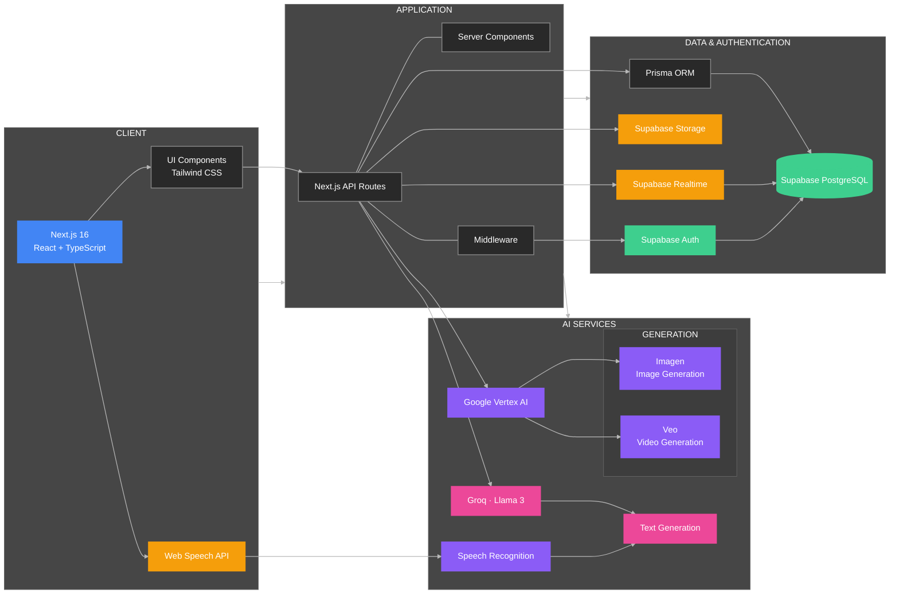

# AIxArtisans

AI-Powered Marketplace Assistant for Local Artisans

## Project Links

- **Live Demo:** [Youtube](https://youtu.be/XkxdKyEOsBI)

## Features by User Role

### For Artisans

- **AI Photo Studio** - Professional product photography with style transfer & image enhancement
- **AI Video Studio** - Generate product videos with slideshow, rotation, and story styles using Vertex AI Veo
- **Voice-to-Product** - Create complete product listings using speech recognition and AI
- **AI Product Descriptions** - Generate compelling descriptions using Groq Llama 3.3 70B
- **Product Management** - Create, edit, and manage product listings with certificates
- **Digital Certificates** - Generate authenticity certificates with QR codes and heritage stories
- **Price Negotiation** - Receive and respond to customer offers with accept/reject/counter options
- **Crowd Funding** - Launch and manage funding campaigns for projects
- **Project Posting** - Post collaboration projects and manage volunteer applications
- **Real-time Chat** - Message customers and volunteers with image sharing

### For Customers

- **Product Marketplace** - Browse and purchase handcrafted items with advanced filtering
- **AI Stylist** - Transform product designs with different styles (minimalist, bohemian, extravagant, classic)
- **Price Negotiation** - Make offers on products and negotiate with artisans
- **Direct Artisan Contact** - Message artisans about custom product modifications and requests
- **Certificate Verification** - View product authenticity certificates
- **Shopping Cart & Favorites** - Full e-commerce functionality with persistent wishlist
- **Real-time Chat** - Communicate with artisans about customizations and orders

### For Volunteers

- **Project Discovery** - Browse and apply to artisan collaboration projects
- **Skill Offering** - Provide marketing, photography, business development, and other professional skills
- **Real-time Collaboration** - Chat with artisans to coordinate project work

### For Everyone

- **Demo Mode** - Experience all features without registration using localStorage persistence
- **Multi-language Support** - Interface available in English & Hindi
- **Responsive Design** - Optimized for desktop, tablet, and mobile devices
- **Dark/Light Mode** - Theme switching for better user experience

## Architecture

## Tech Stack

| Category           | Technology          | Purpose                                               |
| ------------------ | ------------------- | ----------------------------------------------------- |
| **Frontend**       | Next.js 16          | React framework with server-side rendering            |
| **Styling**        | Tailwind CSS        | Utility-first CSS framework                           |
| **Database**       | Supabase PostgreSQL | Cloud-hosted PostgreSQL database                      |
| **ORM**            | Prisma              | Type-safe database client and schema management       |
| **Authentication** | Supabase Auth       | User authentication and authorization                 |
| **File Storage**   | Supabase Storage    | Cloud storage for images and files                    |
| **Real-time Chat** | Supabase Realtime   | WebSocket-based instant messaging                     |
| **AI Services**    | Vertex AI + Groq    | Image/video generation (Imagen, Veo) + Text (Llama 3) |
| **Language**       | TypeScript          | Type-safe JavaScript development                      |
| **Deployment**     | Vercel              | Serverless deployment platform                        |

## App Gallery

    <h3>Landing Page (1)</h3>
    

    <h3>Landing Page (2)</h3>
    

    <h3>Landing Page (3)</h3>
    

    <h3>Login</h3>
    

    <h3>Sign Up</h3>
    

    <h3>Artisan Dashboard</h3>
    

    <h3>Add Product</h3>
    

    <h3>AI Photo Studio</h3>
    

    <h3>AI Video Studio</h3>
    

    <h3>Collaboration Hub (Artisan)</h3>
    

    <h3>Project Posting</h3>
    

    <h3>Connections</h3>
    

    <h3>Conversations</h3>
    

    <h3>Negotiations</h3>
    

    <h3>Finance Funding</h3>
    

    <h3>Volunteer Dashboard</h3>
    

    <h3>Volunteer Project Management</h3>
    

    <h3>Customer Marketplace</h3>
    

    <h3>Demo Product Description Page</h3>
    

    <h3>AI Stylist Features</h3>
    

    <h3>Customer Profile</h3>
    

## Getting Started

Please refer to [CONTRIBUTING.md](./CONTRIBUTING.md) for detailed setup instructions and Supabase configuration.
