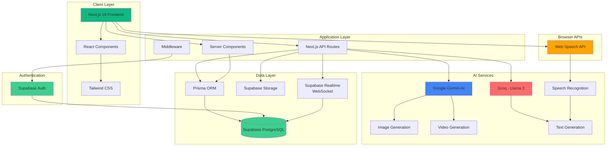

# AIxArtisans

AI-Powered Marketplace Assistant for Local Artisans

## Features

- **AI Photo Studio** - Style transfer, background removal, and image enhancement
- **AI Video Studio** - Automated product video generation with multiple styles
- **Voice-to-Product** - Create product listings using speech recognition
- **Real-time Messaging** - Chat with image sharing between artisans and customers
- **Digital Authenticity Certificates** - Verifiable certificates with QR codes and heritage stories
- **Price Negotiation** - Built-in bargaining system with offer/counter-offer flow
- **Finance Funding** - Project funding platform for artisan initiatives
- **Volunteer Collaboration** - Connect volunteers with artisan projects
- **Multi-language Support** - Interface available in multiple languages

## Architecture



## Tech Stack

| Category           | Technology          | Purpose                                            |
| ------------------ | ------------------- | -------------------------------------------------- |
| **Frontend**       | Next.js 16          | React framework with server-side rendering         |
| **Styling**        | Tailwind CSS        | Utility-first CSS framework                        |
| **Database**       | Supabase PostgreSQL | Cloud-hosted PostgreSQL database                   |
| **ORM**            | Prisma              | Type-safe database client and schema management    |
| **Authentication** | Supabase Auth       | User authentication and authorization              |
| **File Storage**   | Supabase Storage    | Cloud storage for images and files                 |
| **Real-time Chat** | Supabase Realtime   | WebSocket-based instant messaging                  |
| **AI Services**    | Google Gemini       | AI-powered content generation and image processing |
| **AI Services**    | Groq - Llama 3      | Text generation and natural language processing    |
| **Language**       | TypeScript          | Type-safe JavaScript development                   |
| **Deployment**     | Vercel              | Serverless deployment platform                     |

## Getting Started

### 1. Clone and Install

```bash
npm install
```

### 2. Set up Supabase

1. Create a project at [supabase.com](https://supabase.com)
2. Go to Project Settings > Database to get your connection strings
3. Go to Project Settings > API to get your URL and anon key

### 3. Configure Environment

Copy `.env.example` to `.env.local` and fill in your values:

```bash
cp .env.example .env.local
```

```env
NEXT_PUBLIC_SUPABASE_URL=your-supabase-url
NEXT_PUBLIC_SUPABASE_ANON_KEY=your-supabase-anon-key
DATABASE_URL="postgresql://..."
DIRECT_URL="postgresql://..."
GOOGLE_AI_API_KEY=your-google-ai-key
```

### 4. Push Database Schema

```bash
npm run db:push
```

### 5. Generate Prisma Client

```bash
npm run db:generate
```

### 6. Run Development Server

```bash
npm run dev
```

Open [http://localhost:3000](http://localhost:3000)

## Project Structure

```
src/
├── app/
│   ├── (auth)/          # Auth pages (login, signup)
│   ├── api/             # API routes
│   ├── auth/            # Auth callbacks
│   └── page.tsx         # Landing page
├── lib/
│   ├── prisma.ts        # Prisma client
│   ├── supabase/        # Supabase clients
│   ├── ai/              # AI service functions
│   └── utils.ts         # Utility functions
└── types/               # TypeScript types
```

## Database Schema

Key models:

- **User** - Base user with role (ARTISAN, VOLUNTEER, CUSTOMER)
- **ArtisanProfile** / **VolunteerProfile** - Role-specific data
- **Product** - Artisan products with certificates
- **Project** - Volunteer collaboration projects
- **Conversation** / **Message** - Chat system
- **BargainRequest** - Price negotiation
- **Certificate** - Authenticity certificates

## Scripts

- `npm run dev` - Start development server
- `npm run build` - Build for production
- `npm run db:push` - Push schema to database
- `npm run db:generate` - Generate Prisma client
- `npm run db:studio` - Open Prisma Studio
